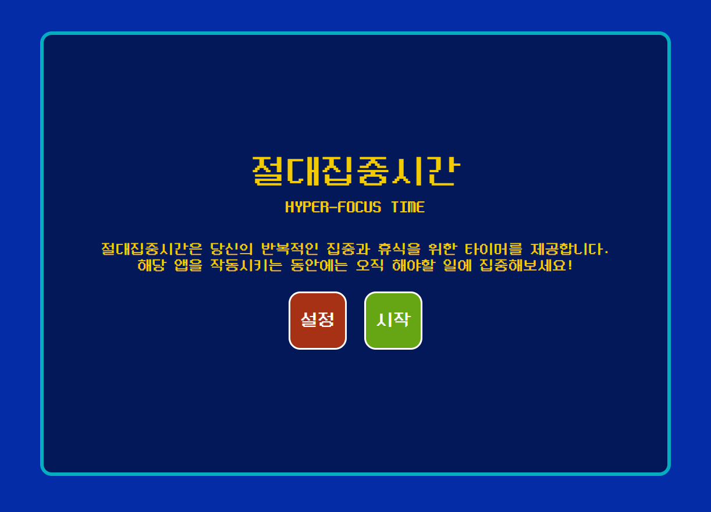
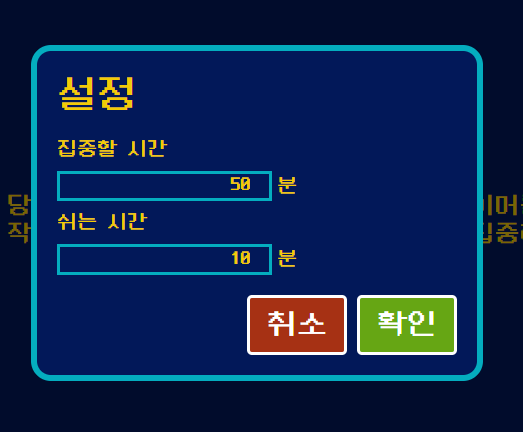
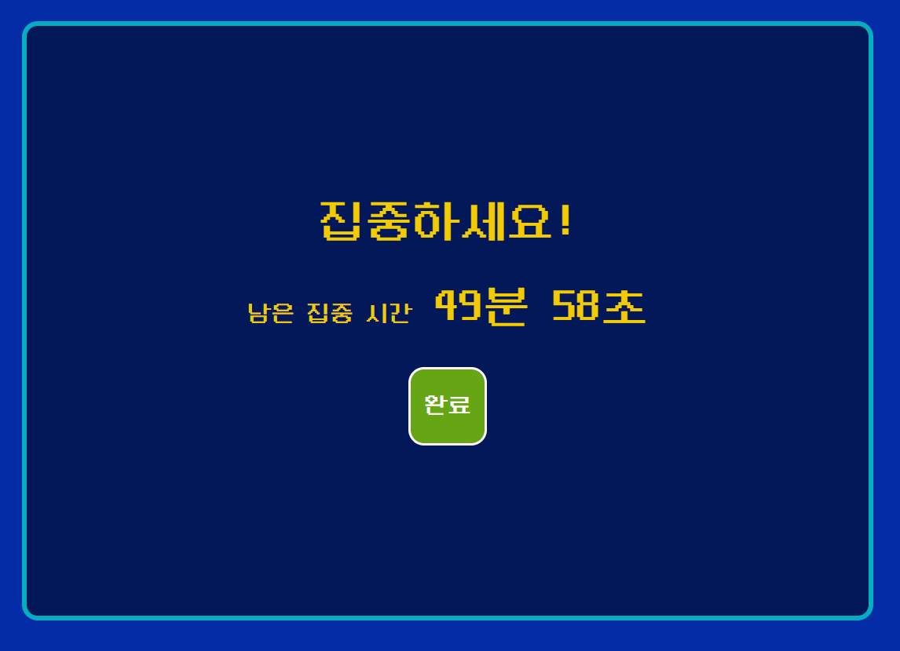
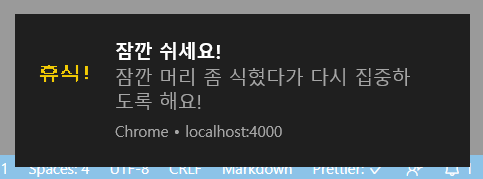

# 절대집중시간

---

절대집중시간은 여러분의 작업에 대한 집중을 돕기 위해 만들어진 간단한 타이머 앱이에요.

동작은 단순합니다! 자신이 집중하고자 하는 시간과 중간중간에 쉬고자 하는 시간을 각각 지정해주세요!

이후 앱을 동작시키면 타이머가 동작합니다. 해당 집중시간 동안에는 스스로 작업에 집중해보세요!

본인이 정한 시간이 경과할 때마다, 해당 앱이 알림을 띄워줄거에요! 물론 사전에 알림 기능을 허용해야 해요. ;)

---

## URL

- 배포된 앱은 [**여기**](https://shubidumdu.github.io/hyper-focus-time/)에서 쓸 수 있어요!

---

## 프로젝트 스택

- VanillaJS
